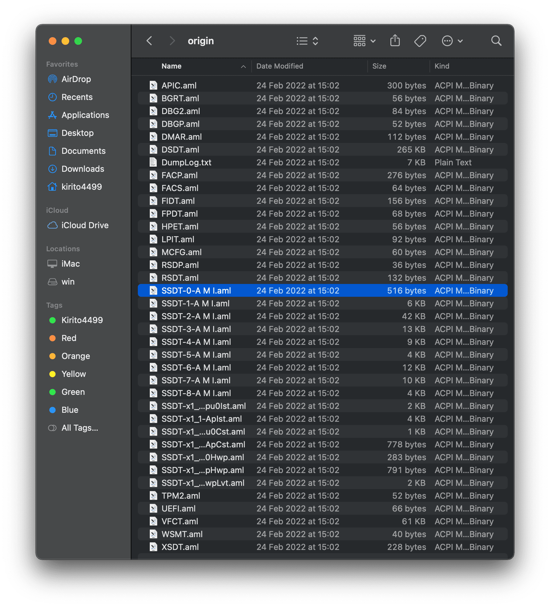

:::info
Bài viết này chỉ nói sơ qua về ACPI để chọn đủ các SSDT phù hợp cho quá trình boot macOS installer. Phần nâng cao về ACPI sẽ được cung cấp trong một series khác vì nó khá khó.
:::

## Khái niệm cơ bản

### ACPI

**ACPI** là viết tắt của **Advanced Configuration and Power Interface**, dịch ra tiếng việt là **Cấu hình nâng cao và Giao diện nguồn** do Intel, Microsoft và Toshiba cùng đề xuất và xây dựng vào năm 1997, sau đó có thêm HP, Huawei và Phoenix tham gia. ACPI xác định giao diện giữa phần mềm hệ thống BIOS hoặc UEFI và hệ điều hành, giao diện trừu tượng hóa phần cứng.

Nó giúp hệ điều hành kiểm soát và phân phối hợp lý sức mạnh của các thiết bị phần cứng máy tính. Với ACPI, hệ điều hành có thể tắt các thiết bị phần cứng khác nhau khi cần theo tình hình thực tế của thiết bị.

Các tính năng chính của nó bao gồm:

1. System power management
2. Device power management
3. Processor power management
4. Device and processor performance management
5. Configuration / Plug and Play
6. System Events
7. Battery management
8. Thermal management
9. Embedded Controller
10. SMBus Controller

ACPI gồm nhiều bảng, mỗi bảng là một file đuôi .aml, bao gồm: RSDP, SDTH, RSDT, FADT, FACS, **DSDT**, **SSDT**, MADT, SBST, XSDT, ECDT, SLIT, SRAT. Trong số đó, DSDT là bảng mô tả quan trọng nhất.

Dưới đây là nguyên bộ ACPI của mainboard Z390 Aorus Pro được dump bằng Clover

### DSDT, SSDT

Như đã đề cập ở trên, DSDT và SSDT là một phần của ACPI có tác dụng phác thảo các thiết bị phần cứng như bộ điều khiển USB, luồng CPU, bộ điều khiển nhúng, đồng hồ hệ thống, hệ thống các luồng PCI, ...

DSDT (Differentiated System Description Table) có thể được coi là phần thân chứa hầu hết thông tin phần cứng

SSDT (Secondary System Description Table) là bảng phụ của DSDT, sẽ được gộp vào DSDT khi nạp hệ điều hàng, thường chứa các một hoặc một ít giao thức về CPU, GPU, hệ thống cảm biến, SATA, ...

DSDT có thể được coi là bản thiết kế kiến ​​trúc, trong đó SSDT là ghi chú cố định phác thảo các chi tiết bổ sung của một dự án.

Khi Hackintosh, DSDT thường được trích xuất đầu tiên, sau đó SSDT tương ứng được ghi theo nội dung của DSDT để sửa DSDT gọi là **hot patch** đây là điều mà khiến hackintosh dễ dàng hơn và dễ tiếp cận hơn. Tất nhiên, cũng có thể sửa đổi DSDT trực tiếp mà không cần sử dụng SSDT gọi là **static patch**, ngày xưa lúc tôi bắt đầu chơi thì vẫn dùng cách này là chính. **Patch DSDT/SSDT** là cần thiết để thực hiện khắc phục sự cố và điều chỉnh code DSDT cho tương thích với macOS.

  
<strong>Nguyên nhân sinh ra SSDT?</strong>

  

    Để dễ dàng tái sử dụng code ACPI khi sản xuất hàng loạt model mainboard có cùng kiến trúc. Cụ thể như sau, mainboard cùng một hãng, cùng một chipset, VD <a href="https://www.gigabyte.com/Motherboard/Intel-Z390">Gigabyte Z390</a> thì gần như DSDT của chúng giống nhau, sự khác nhau tới từ SSDT hoặc SSDT chả khác gì luôn! Đây cũng là nguyên do bộ SSDT trong EFI của mainboard này có thể mang đi dùng cho mainboard khác.
  

### Tại sao bạn cần phải biết điều này?

Những kiến thức này hiện tại đang rất trừu tượng, nhưng nó rất quan trọng với hackintosh. Đơn giản bởi vì macOS cũng là hệ điều hành và nó cần ACPI để nhận diện và điều khiển phần phần cứng. Các thiết bị real mac như macbook, iMac, mac mini đều có bộ ACPI riêng, vấn đề ở đây là qui định về tên và các thành phần trong DSDT/SSDT của real mac nó khác so với những mainboard thông thường khác.

VD đối với card đồ hoạ onboard, trong DSDT máy mac nó tên là **IGPU**, nhưng trong DSDT mainboard thường thì nó lại tên là **GFX0**, vậy nếu để nguyên **GFX0** thì macOS sẽ không nhận ra card onboard và không khởi động được. Do đó cần phải sửa **GFX0** thành **IGPU** trong DSDT trước khi nạp vào hệ điều hành, có thể là hot patch hay static patch đều được. Sẽ cần phải đổi tên nhiều device khác nữa, hiện nay đa số việc đổi tên này đều do kext **WhateverGreen** đảm nhiệm nên bạn sẽ không cần thêm các hot pach rename như lúc xưa!

### Các thành phần cần cơ bản được chỉnh sửa

macOS sẽ có yêu cầu một số hiện diện device mà không có hoặc bị tắt đi trong DSDT, vì vậy chúng ta cần khắc phục vấn đề này. Các device cần thiết phải được chỉnh sửa để macOS có thể khởi động động bình thường:

+ **Embedded controllers (EC)**
  + Tất cả các mainboard của Apple đều có device EC trong DSDT, nhưng mà tên của chúng không phải là **EC** mà là **EC0, ECDV, H_EC**. Kể từ macOS Catalina trở đi, yêu cầu cần có một device tên là **EC** thì mới khởi động được.
  + Có hai cách xử lý, một là rename **EC0** hay **H_EC** thành **EC**, hai là tạo một device giả (fake device) có tên là **EC** (SSDT-EC.aml)
  + Đối với laptop, embedded controller cần thiết để có thể dùng pin và phím tắt. Việc đổi tên sẽ gây ra sự cố với Windows do OpenCore sẽ nạp ACPI đã sửa còn Clover thì không, do đó thường sử dụng cách thứ hai là giả maọ device.

+ **Plugin type**
  + Cho phép sử dụng XCPM để cung cấp khả năng quản lý nguồn CPU trên Intel Haswell và các CPU mới hơn, điều này không tương thích với AMD
  + Hiểu đơn giản là có cái này CPU mới chạy ổn định, nhận đủ xung nhịp, không nhảy xung lên xuống một cách lung tung.

+ **AWAC system clock**
  + Đây là một thiết bị mới có trên dòng mainboard 3000 series trở đi, nó thay thế cho RTC clock (khi AWAC bật thì RTC tắt). Vấn đề ở đây là macOS nó lại cần RTC chứ không cần AWAC
  + Vẫn là hai cách, chỉnh sửa code ACPI để bật RTC tắt AWAC (**SSDT-AWAC-DISABLE.aml**), hoặc tạo device giả mạo (**SSDT-RTC0.aml**)

+ **NVRAM SSDT**
  + Dòng main board 300 series (trừ chipset Z370) kể cả pc lẫn laptop sẽ dính lỗi không hỗ trợ ghi NVRAM, cần sửa lỗi này để quá trình bật tắt hay cài đặt macOS diễn ra bình thường (**SSDT-PMC.aml**)

+ **Backlight**
  + Sử dụng để sửa lỗi hỗ trợ điều khiển đèn nền (tăng giảm độ sáng màn hình) trên laptop (**SSDT-PNLF.aml**)

<!--
+ **GPIO SSDT**
    - Được sử dụng để cho phép VoodooI2C có thể chạy, chỉ dành cho laptop dùng i2c trackpad/touch

+ **XOSI SSDT**
    - Được sử dụng để điều hướng hàm _OSI tới SSDT này, chủ yếu được sử dụng để đánh lừa phần cứng của rằng nó đang khởi động Windows để có thể nhận diện được trackpad    

+ **IRQ SSDT and ACPI patches**
    - Được sử dụng để khắc phục xung đột IRQ trong DSDT, chủ yếu cho máy tính xách tay. Dùng [SSDTTime](https://github.com/corpnewt/SSDTTime) để tạo
    - Hệ thống Skylake trở lên rất hiếm khi gặp lỗi xung đột IRQ, patch này chủ yếu cho hệ thống Broadwell trở xuống, cá nhân tôi gần như không sử dụng bản vá lỗi này. -->

## Chọn bộ SSDT phù hợp

:::info

+ Phần này, tôi sẽ đưa ra danh sách những SSDT cần thiết cho quá trình boot macOS để cài đặt, theo cấu hình máy.
+ SSDT có thể được biên dịch theo cách thủ công hoặc tải xuống các bản đã được biên dịch, nếu không gắn link tức là có sẵn trong file OC đã tải trước đó, path: **OpenCore/Docs/AcpiSamples/Binaries**
+ Tôi sẽ hướng dẫn các bạn chỉnh sửa và biên dịch SSDT trong phần nâng cao.
:::

Sau khi chọn được bộ SSDT thì bạn chép tất cả chúng vào **EFI/OC/ACPI**

### Intel Desktop

#### **SandyBridge**, **Ivy Bridge**

+ SSDT-PM.aml
  + Intel Power Management
  + Bạn cần tạo SSDT-PM.aml của riêng mình，lúc cài đặt có thể không cần, tham khảo [Sandy and Ivy Bridge Power Management](/docs/post-install/fixing-power-management)
  + Lúc cài đặt chưa có SSDT-PM, cần xoá 2 bảng ACPI sau：**CpuPm**, **Cpu0Ist**. Sau khi cài và tự tạo được SSDT-PM thì ko cần xoá nữa. Sẽ hướng dẫn ở phần chỉnh sửa config.
+ [SSDT-EC-DESKTOP.aml](https://github.com/dortania/Getting-Started-With-ACPI/blob/master/extra-files/compiled/SSDT-EC-DESKTOP.aml)

#### **Hasewel**, **Broadwell**

+ SSDT-PLUG.aml
+ [SSDT-EC-DESKTOP.aml](https://github.com/dortania/Getting-Started-With-ACPI/blob/master/extra-files/compiled/SSDT-EC-DESKTOP.aml)

#### **Skylake**, **Kaby Lake**

+ SSDT-PLUG.aml
+ [SSDT-EC-USBX-DESKTOP.aml](https://github.com/dortania/Getting-Started-With-ACPI/blob/master/extra-files/compiled/SSDT-EC-USBX-DESKTOP.aml)

#### **Coffee Lake**

+ SSDT-PLUG.aml
+ [SSDT-EC-USBX-DESKTOP.aml](https://github.com/dortania/Getting-Started-With-ACPI/blob/master/extra-files/compiled/SSDT-EC-USBX-DESKTOP.aml)
+ SSDT-AWAC-DISABLE.aml
+ SSDT-PMC.aml
  + Sửa lỗi NVRAM cho mainboard chipset H310, B360, B365, H370, Z390 trừ Z370 ra

#### **Comet Lake**, **Tiger Lake**

+ SSDT-PLUG.aml
+ [SSDT-EC-USBX-DESKTOP.aml](https://github.com/dortania/Getting-Started-With-ACPI/blob/master/extra-files/compiled/SSDT-EC-USBX-DESKTOP.aml)
+ SSDT-AWAC-DISABLE.aml
+ [SSDT-RHUB.aml](https://github.com/dortania/Getting-Started-With-ACPI/blob/master/extra-files/compiled/SSDT-RHUB.aml)
  + Một số mainboard OEM có phần ACPI RHUB bị hỏng, cần tắt thiết bị RHUB đi thì macOS mới khởi động được
  + ASUS Z490 sẽ cần nó, MSI có thể cũng sẽ cần, Gigabyte và ASRock thì không cần

### Intel Laptop

#### **Sany Bridge**, **Ivy Bridge**

+ SSDT-PM.aml
  + Intel Power Management
  + Bạn cần tạo SSDT-PM.aml của riêng mình，lúc cài đặt có thể không cần, tham khảo [Sandy and Ivy Bridge Power Management](/docs/post-install/fixing-power-management)
  + Lúc cài đặt chưa có SSDT-PM, cần xoá 2 bảng ACPI sau：**CpuPm**, **Cpu0Ist**. Sau khi cài và tự tạo được SSDT-PM thì ko cần xoá nữa. Sẽ hướng dẫn ở phần chỉnh sửa config.
+ [SSDT-EC-LAPTOP.aml](https://github.com/dortania/Getting-Started-With-ACPI/blob/master/extra-files/compiled/SSDT-EC-LAPTOP.aml)
+ SSDT-PNLF.aml
+ SSDT-IMEI.aml
  + Sửa lỗi Ivy Bridge CPU đi kèm với mainboard 6 series
  + Sửa lỗi Sandy Bridge CPU đi kèm với mainboard 7 series

#### **Hasewel**, **Broadwell**

+ SSDT-PLUG.aml
+ [SSDT-EC-LAPTOP.aml](https://github.com/dortania/Getting-Started-With-ACPI/blob/master/extra-files/compiled/SSDT-EC-LAPTOP.aml)

#### **Skylake**, **Kaby Lake**, **Kaby Lake - R**

+ SSDT-PLUG.aml
+ [SSDT-EC-USBX-LAPTOP.aml](https://github.com/dortania/Getting-Started-With-ACPI/blob/master/extra-files/compiled/SSDT-EC-USBX-LAPTOP.aml)
+ SSDT-PNLF.aml

#### **Coffee Lake**, **Whiskey Lake**

+ SSDT-PLUG.aml
+ [SSDT-EC-USBX-LAPTOP.aml](https://github.com/dortania/Getting-Started-With-ACPI/blob/master/extra-files/compiled/SSDT-EC-USBX-LAPTOP.aml)
+ SSDT-PMC.aml
  + Sửa lỗi NVRAM, do mainboard laptop thường là chipset HM370
+ SSDT-PNLF.aml

#### **Comet Lake**

+ SSDT-PLUG.aml
+ [SSDT-EC-USBX-LAPTOP.aml](https://github.com/dortania/Getting-Started-With-ACPI/blob/master/extra-files/compiled/SSDT-EC-USBX-LAPTOP.aml)
+ SSDT-PNLF.aml

#### **Ice Lake**

+ SSDT-PLUG.aml
+ [SSDT-EC-USBX-LAPTOP.aml](https://github.com/dortania/Getting-Started-With-ACPI/blob/master/extra-files/compiled/SSDT-EC-USBX-LAPTOP.aml)
+ SSDT-PNLF.aml
+ [SSDT-RHUB.aml](https://github.com/dortania/Getting-Started-With-ACPI/blob/master/extra-files/compiled/SSDT-RHUB.aml)
  + Cần sửa lỗi RHUB trên nhiều laptop Icelake
  
### Intel HEDT

#### **Sandy Bridge-E**, **Ivy Bridge-E**

+ [SSDT-EC-DESKTOP.aml](https://github.com/dortania/Getting-Started-With-ACPI/blob/master/extra-files/compiled/SSDT-EC-DESKTOP.aml)
+ SSDT-UNC.aml
  + Tắt các thiết bị không sử dụng trong ACPI để đảm bảo IOPCIFamily gây kernel panic
  + Tất cả các mainboard X99 và hầu hết các mainboard X79 đều yêu cầu SSDT này
  + Ngoài ra, một số mainboard C602, C612 cũng cần SSDT này

#### **Haswell-E**, **Broadwell-E**

+ SSDT-PLUG.aml
+ [SSDT-EC-USBX-DESKTOP.aml](https://github.com/dortania/Getting-Started-With-ACPI/blob/master/extra-files/compiled/SSDT-EC-USBX-DESKTOP.aml)
+ [SSDT-RTC0-RANGE-HEDT.aml](https://github.com/dortania/Getting-Started-With-ACPI/blob/master/extra-files/compiled/SSDT-RTC0-RANGE-HEDT.aml)
  + Big Sur yêu cầu RTC phải đầy đủ (sẽ giải thích kĩ hơn trong phần ACPI nâng cao)
+ SSDT-UNC.aml
  + Tắt các thiết bị không sử dụng trong ACPI để đảm bảo IOPCIFamily gây kernel panic
  + Tất cả các mainboard X99 và hầu hết các mainboard X79 đều yêu cầu SSDT này
  + Ngoài ra, một số mainboard C602, C612 cũng cần SSDT này

#### **Skylake-X/W**, **Cascade Lake-X/W**

+ SSDT-PLUG.aml
+ [SSDT-EC-USBX-DESKTOP.aml](https://github.com/dortania/Getting-Started-With-ACPI/blob/master/extra-files/compiled/SSDT-EC-USBX-DESKTOP.aml)
+ [SSDT-RTC0-RANGE-HEDT.aml](https://github.com/dortania/Getting-Started-With-ACPI/blob/master/extra-files/compiled/SSDT-RTC0-RANGE-HEDT.aml)
  + Big Sur yêu cầu RTC phải đầy đủ (sẽ giải thích kĩ hơn trong phần ACPI nâng cao)

### AMD Desktop

#### **Bulldozer(15h)**, **Jaguar(16h)**

+ [SSDT-EC-USBX-DESKTOP.aml](https://github.com/dortania/Getting-Started-With-ACPI/blob/master/extra-files/compiled/SSDT-EC-USBX-DESKTOP.aml)

#### **Ryzen**, **Threadripper(17h and 19h)**

+ [SSDT-EC-USBX-DESKTOP.aml](https://github.com/dortania/Getting-Started-With-ACPI/blob/master/extra-files/compiled/SSDT-EC-USBX-DESKTOP.aml)
+ [SSDT-CPUR.aml](https://github.com/dortania/Getting-Started-With-ACPI/blob/master/extra-files/compiled/SSDT-CPUR.aml)
  + Dùng cho B550 và A520 sửa lỗi ACPI phần CPU，các mainboard khác không dùng
  + X570 trở về sau sẽ không cần SSDT này
